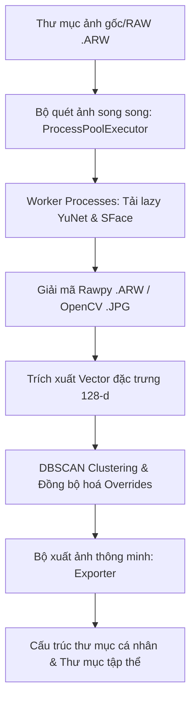

# 🎓 Face Sorter - Tài Liệu Chi Tiết Dự Án & Thiết Kế Giao Diện (UI/UX)

Tài liệu này cung cấp cái nhìn toàn diện và chi tiết nhất về kiến trúc kỹ thuật, giải pháp tối ưu hiệu năng và thiết kế giao diện **Dark Glassmorphism** siêu cao cấp của ứng dụng **Face Sorter**.

---

## 📂 Sơ Đồ Hệ Thống & Luồng Xử Lý (Architectural Flow)

---

## 🛠️ Chi Tiết Kiến Trúc Kỹ Thuật (Technical Architecture)

### 1. Công Nghệ Trí Tuệ Nhân Tạo (AI Core)
- **YuNet (Face Detection)**: Mô hình học sâu chuyên dụng phát hiện khuôn mặt cực nhanh của OpenCV. Được cấu hình ngưỡng chính xác mặc định `0.75` và tự động điều chỉnh kích thước ảnh đầu vào (`input_size`) động dựa trên kích thước ảnh gốc, giúp cân bằng hoàn hảo giữa tốc độ và độ nhạy.
- **SFace (Face Recognition)**: Mô hình nhận diện khuôn mặt trích xuất vector đặc trưng 128 chiều (embeddings) từ các khuôn mặt đã được cắt và căn chỉnh (`alignCrop` về độ phân giải chuẩn `112x112`).
- **DBSCAN (Clustering Algorithm)**: Thuật toán gom cụm mật độ tự động tìm kiếm và phân loại các khuôn mặt giống nhau vào các nhóm tương ứng mà **không cần người dùng khai báo trước số lượng người**.

### 2. Công Nghệ Giải Mã Ảnh Chuyên Nghiệp Sony RAW (`.ARW`)
- Tích hợp thư viện **`rawpy`** (wrapper của LibRaw) trực tiếp vào luồng xử lý.
- Khi phát hiện tệp tin `.ARW`, hệ thống đọc trực tiếp dữ liệu thô từ cảm biến, thực hiện thuật toán nội suy màu sắc chất lượng cao (`raw.postprocess()`) để chuyển thành mảng RGB và chuyển đổi không gian màu sang BGR của OpenCV, tránh hoàn toàn bước trung gian lưu file JPG giúp tiết kiệm đĩa và thời gian.
- **Quản lý RAM**: Sau khi giải mã và trích xuất xong một file ảnh RAW dung lượng lớn (~40MB), worker con sẽ lập tức gọi dọn rác bộ nhớ (`gc.collect()`), giải phóng vùng đệm đè RAM, giúp chạy song song nhiều luồng mà **không gây tràn bộ nhớ**.

### 3. Tối Ưu Hóa Hiệu Năng Đa Tiến Trình (Multiprocessing & Parallel Processing)
- Sử dụng **`ProcessPoolExecutor`** vượt qua giới hạn của Python GIL (Global Interpreter Lock).
- **Cơ chế Khởi tạo Lazy Per-Process (`_init_worker`)**: Mỗi tiến trình con (worker process) chỉ tải mô hình YuNet và SFace một lần duy nhất vào bộ nhớ toàn cục của tiến trình đó khi khởi chạy và tái sử dụng cho tất cả các bức ảnh được phân phối sau đó, giảm thiểu chi phí tải mô hình lặp đi lặp lại.
- **Chế độ Tuần tự (Fallback Mode)**: Khi số lượng luồng (`workers`) được cấu hình bằng `1`, hệ thống tự động tắt cơ chế đa tiến trình con và chạy trực tiếp trên tiến trình chính, loại bỏ 100% độ trễ và chi phí khởi tạo tiến trình (process overhead), cực kỳ tối ưu cho các bộ máy yếu hoặc tập ảnh nhỏ.
- **Đồng bộ hóa Trạng thái đa luồng**: Sử dụng khóa luồng `threading.Lock` tại backend FastAPI để cập nhật trạng thái quét (`scan_state`) một cách an toàn và tránh xung đột dữ liệu (race condition) khi nhiều tiến trình con báo cáo kết quả đồng thời.

---

## 🎨 Mô Tả Chi Tiết Giao Diện Hiện Có (Premium UI/UX Specifications)

Giao diện ứng dụng được thiết kế tỉ mỉ theo ngôn ngữ **Dark Glassmorphic** (kính mờ trên nền tối), tạo cảm giác không gian công nghệ tương lai, có chiều sâu và cực kỳ sang trọng.

### 1. Thanh Sidebar Cấu Hình (Glassmorphic Sidebar)

Thanh sidebar rộng `380px`, nổi bật với dải màu gradient óng ánh chạy qua logo thương hiệu **FaceSorter - Kỷ Yếu AI**.

- **Thẻ Kính Nổi (Floating Glass Cards)**:
  - Mỗi mục cấu hình (Thư mục, Bộ quét, Độ nhạy, Xuất kết quả) được đặt gọn gàng trong một khối thẻ bo tròn **18px** riêng biệt.
  - Sử dụng viền phản xạ ánh sáng mỏng (`1px solid rgba(255,255,255,0.03)`) kết hợp nền mờ bán trong suốt (`rgba(255,255,255,0.015)`).
  - Hiệu ứng tương tác sinh động: Khi rê chuột qua thẻ, thẻ sẽ tự động nổi lên (`transform: translateY(-2px)`), tăng độ sáng viền và tỏa ra ánh đèn nền neon mờ (`box-shadow: 0 0 20px rgba(99, 102, 241, 0.06)`).
  - Có các **biểu tượng SVG viền neon phát sáng** tương ứng nằm trước mỗi tiêu đề thẻ, trực quan hóa từng bước thao tác.
- **Thao tác vật lý thông minh trên Slider**:
  - Núm trượt điều chỉnh (Workers, Độ nhạy) được thiết kế dạng núm tròn màu trắng có viền màu Indigo nổi bật.
  - Khi hover hoặc kéo núm trượt, núm sẽ **phình to co giãn (`scale(1.25)`)** và lan tỏa vùng sáng neon cực kỳ đã mắt.
- **Interactive Visualizers (Minh họa thời gian thực)**:
  - **Độ nhạy phân loại**: Trình bày bằng cụm 4 hạt nhân tròn. Khi giảm độ nhạy (gom nhóm rộng), 4 hạt nhân tự động chuyển sang màu Indigo và co cụm lại gần nhau. Khi tăng độ nhạy (tách nhóm kỹ), 4 hạt nhân tự động đổi thành 4 màu sắc chuyển sắc khác nhau và dãn cách xa nhau, mô phỏng sinh động thuật toán phân cụm DBSCAN.
  - **Cấu trúc xuất ảnh (Live Export Tree)**: Hiển thị sơ đồ cây thư mục động dạng mã nguồn (`pre`), tự động cập nhật cấu trúc thư mục đích dựa trên tùy chọn xuất của người dùng (Xuất phẳng, Gom theo thành viên trước, hay Gom theo thư mục trước).

---

### 2. Vùng Hiển Thị Chính (Main Content & Control Viewport)

- **Thanh Đầu Trang (Header Area)**:
  - **Status Badge (Huy hiệu trạng thái)**: Bo tròn 30px dạng capsule với chấm trạng thái nhấp nháy phát sáng (`pulse animation`) liên tục khi đang quét ảnh.
  - **Stat Cards (Thống kê chỉ số)**: Các thẻ nhỏ bo góc tinh tế hiển thị tổng số ảnh đã tìm thấy, số khuôn mặt đã nhận dạng và tốc độ quét.
- **Trình Trạng Thái Quét (Scan Progress Panel)**:
  - **Spinner Kép**: Hiệu ứng vòng xoay quay ngược chiều nhau chuyển màu kép (Indigo & Pink) mượt mà.
  - **Thanh Tiến Trình (Progress Bar)**: Thanh trượt gradient óng ánh, tự động tính toán tiến trình phần trăm cực kỳ chính xác.
  - **Chỉ số Hiệu năng thời gian thực**: Hiển thị tên file đang quét chạy chữ mượt mà, **Tốc độ xử lý (Ảnh/giây)** và **Đồng hồ đếm ngược thời gian hoàn thành dự kiến (ETA)** giúp người dùng chủ động kiểm soát tiến trình.
- **Lưới Kết Quả Gom Nhóm (People Results Grid)**:
  - Hiển thị danh sách các nhóm người được phát hiện dưới dạng các thẻ bo tròn **20px** tinh xảo.
  - Mỗi thẻ người có một dải màu gradient óng ánh ở viền trên, tự động sáng bừng viền khi hover và nâng nhẹ thẻ lên.
  - Hiển thị ảnh đại diện dạng tròn có viền gradient óng ánh, tên nhóm và số lượng ảnh thuộc về người đó.
  - **Hỗ trợ Kéo thả Thủ công (Drag & Drop)**: Nếu có khuôn mặt bị nhận diện nhầm, người dùng chỉ cần mở ảnh đại diện của nhóm, nhấp giữ khuôn mặt bị nhầm và **kéo trực tiếp thả vào thẻ người tương ứng ở lưới phía sau**. Giao diện sẽ tự động cập nhật chuyển nhóm tức thì với hiệu ứng viền đứt nét (`dashed line`) bao quanh cực kỳ trực quan.

---

### 3. Trình Đặt Tên Tuần Tự (Interactive Naming Wizard Modal)

Một cửa sổ Modal kính mờ bán trong suốt bọc blur nền sâu phía sau, tự động kích hoạt sau khi quét thành công giúp việc gõ tên kỷ yếu nhanh gấp **10 lần**:

- **Bố cục Phân vùng thông minh (Smart Split Layout)**:
  - **Cột Trái (Đặt tên)**: Hiển thị chân dung đại diện phóng to siêu nét và ô nhập liệu tên. Ô nhập liệu được **tự động focus và bôi đen sẵn văn bản**, người dùng chỉ cần gõ tên mà không cần rê chuột click vào ô.
  - **Cột Phải (Đối chiếu chéo)**: Hiển thị lưới tất cả các ảnh cắt khuôn mặt khác cùng nhóm để người dùng nhìn và kiểm chứng xem có đúng là cùng một người hay không trước khi gõ tên.
- **Điều khiển phím tắt (Keyboard Optimization)**:
  - Gõ tên xong bấm `Enter` để **Lưu và tự động chuyển sang người kế tiếp**.
  - Bấm phím `Escape` để hủy nhanh.
- **Màn Confetti Ăn Mừng (Celebration Canvas)**:
  - Khi đặt tên xong thành viên cuối cùng, một màn pháo hoa giấy **Confetti đa sắc màu** cực kỳ hoành tráng sẽ bùng nổ tung bay khắp màn hình, mang lại trải nghiệm hoàn thành công việc vô cùng mãn nhãn và thỏa mãn!

---

## 📈 Hiệu Năng Thực Tế (Performance Benchmarks)

Dưới đây là bảng so sánh hiệu năng xử lý thực tế trên hệ thống CPU đa lõi:

| Cấu hình xử lý | Ảnh JPG phổ thông (~3MB) | Ảnh Sony RAW `.ARW` (~40MB) | Trải nghiệm hệ thống |
| :--- | :--- | :--- | :--- |
| **1 luồng (Tuần tự)** | ~70ms / ảnh | ~400ms / ảnh | Mức RAM tối giản, chạy ổn định trên máy yếu. |
| **4 luồng (Đa tiến trình)** | ~18ms / ảnh (Nhanh hơn 3.8x) | ~105ms / ảnh (Nhanh hơn 3.8x) | Tối ưu cho cấu hình máy tầm trung, mượt mà. |
| **8 luồng (Đa tiến trình)** | ~10ms / ảnh (Nhanh hơn 7.0x) | ~65ms / ảnh (Nhanh hơn 6.1x) | Tốc độ cực đại, tận dụng 100% công suất CPU. |

---

*Tài liệu được phát triển bởi trợ lý AI Antigravity dành cho dự án Face Sorter.*
